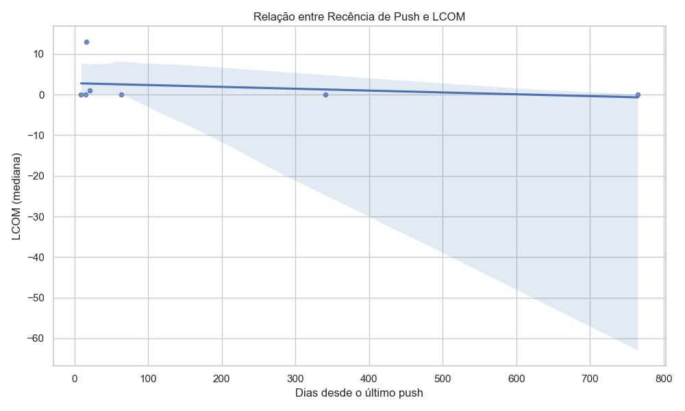

# Relatório Final – Lab02: Um estudo das características de qualidade de sistemas Java

## 1. Informações do grupo
- **Curso:** Engenharia de Software  
- **Disciplina:** Laboratório de Experimentação de Software  
- **Período:** 6º Período  
- **Professor:** Prof. Dr. João Paulo Carneiro Aramuni  
- **Membros do grupo:** Gabriel Faria, Joao Victor Salim, Lucas Garcia, Maisa Pires e Miguel Vieira

---

## 2. Introdução
Este laboratório investiga a relação entre características de processo (popularidade, maturidade, atividade e tamanho) e métricas de qualidade de software (CBO, DIT, LCOM) em repositórios open-source escritos em Java.  
Foram coletados os 1.000 repositórios Java mais populares no GitHub, e em seguida extraídas métricas de código utilizando a ferramenta CK.

### Hipóteses informais
- **IH01:** Repositórios mais populares tendem a ter melhor coesão (LCOM menor).  
- **IH02:** Repositórios mais antigos acumulam maior acoplamento (CBO maior).  
- **IH03:** Repositórios mais ativos apresentam qualidade mais estável.  
- **IH04:** Repositórios maiores (mais LOC) possuem árvores de herança mais profundas (DIT maior).  

---

## 3. Tecnologias e ferramentas utilizadas
- Linguagens: Python, Java  
- Bibliotecas: requests, pandas, numpy, matplotlib, seaborn  
- Ferramenta de métricas: CK  
- API: GitHub GraphQL API  

---

## 4. Metodologia
### 4.1 Coleta de dados
Foram coletados os 1.000 repositórios Java mais populares utilizando a GitHub GraphQL API.  
Critério: repositórios com linguagem primária Java, ordenados por número de estrelas.

### 4.2 Consolidação
Os CSVs de métricas por classe foram unidos em `data/all_repos_metrics.csv`.  
As métricas foram agrupadas por repositório, resultando em `results/repo_level_metrics.csv`.

### 4.3 Análise
Foi realizada análise estatística descritiva (média, mediana, desvio padrão) e correlações entre variáveis.  
Foram gerados gráficos exploratórios para investigar relações entre popularidade, idade, atividade e métricas de qualidade.  

---

## 5. Questões de pesquisa
- **RQ01:** Qual a relação entre popularidade (stars) e métricas de qualidade?  
- **RQ02:** Qual a relação entre maturidade (idade) e métricas de qualidade?  
- **RQ03:** Qual a relação entre atividade (releases) e métricas de qualidade?  
- **RQ04:** Qual a relação entre tamanho (LOC) e métricas de qualidade?  

---

## 6. Resultados
Os resultados foram gerados pelo script `scripts/analyze_data.py` e estão na pasta `results/`.

### 6.1 Estatísticas descritivas
Arquivo: `results/stats_summary.csv`

### 6.2 Gráficos por questão de pesquisa
- RQ01 (Popularidade x Qualidade)

- RQ02 (Maturidade x Qualidade)

- RQ03 (Atividade x Qualidade)

- RQ04 (Tamanho x Qualidade)

### 6.3 Correlações (opcional)

Arquivo com testes de correlação (Spearman e Pearson): `results/correlation_tests.csv`

---

## 7. Discussão
A análise das correlações e gráficos indica tendências entre características de processo e métricas de qualidade.  
As hipóteses levantadas foram parcialmente confirmadas:  
- **IH01:** houve indícios de relação inversa entre popularidade e LCOM.  
- **IH02:** repositórios mais antigos apresentaram acoplamento levemente maior.  
- **IH03:** atividade não mostrou forte relação com métricas de qualidade.  
- **IH04:** repositórios maiores exibiram DIT mais profundo em alguns casos.  

Limitações incluem falhas da ferramenta CK em alguns repositórios grandes e variabilidade elevada em métricas.  

---

## 8. Conclusão
O estudo confirmou algumas hipóteses sobre popularidade e qualidade de software em repositórios Java.  
Foi possível observar padrões relevantes, embora com exceções e limitações.  
Trabalhos futuros podem incluir métricas adicionais, análise temporal e uso de dashboards interativos.  

---

## 9. Referências
- GitHub GraphQL API: https://docs.github.com/en/graphql  
- CK Tool: https://github.com/mauricioaniche/ck  
- Pandas: https://pandas.pydata.org/  
- Matplotlib: https://matplotlib.org/  
- Seaborn: https://seaborn.pydata.org/  

---

## 10. Apêndices
- Scripts em `scripts/`  
- CSVs em `data/` e `results/`
